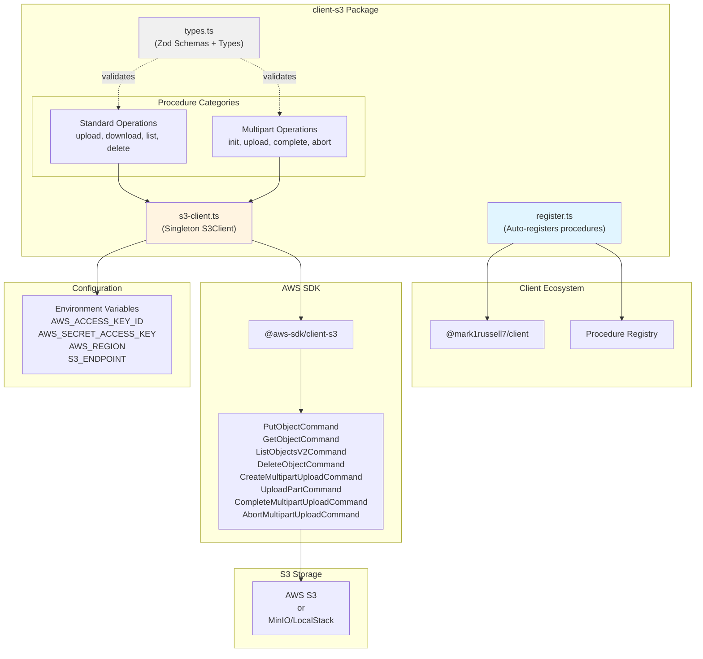

# @mark1russell7/client-s3

[](https://opensource.org/licenses/MIT)
[](https://www.typescriptlang.org/)
[](https://nodejs.org/)

AWS S3 operations as RPC procedures. Upload, download, list, delete, and perform multipart uploads via `client.call()`.

## Overview

`client-s3` provides comprehensive AWS S3 access through the client procedure ecosystem with:
- **Standard operations**: Upload, download, list, delete objects
- **Multipart uploads**: Large file uploads with resumable parts
- **Environment-based config**: AWS credentials from environment variables
- **Zod validation**: Runtime type safety on all inputs
- **MinIO/LocalStack support**: Custom S3 endpoints for testing

The package auto-registers 8 procedures:
- **Standard**: `s3.upload`, `s3.download`, `s3.list`, `s3.delete`
- **Multipart**: `s3.multipart.init`, `s3.multipart.upload`, `s3.multipart.complete`, `s3.multipart.abort`

## Architecture



### Package Dependency Flow

```mermaid
graph LR
    App["Your Application"]
    ClientS3["@mark1russell7/client-s3"]
    Client["@mark1russell7/client"]
    Zod["zod"]
    AWSSDK["@aws-sdk/client-s3"]

    App --> ClientS3
    ClientS3 --> Client
    ClientS3 --> Zod
    ClientS3 --> AWSSDK

    App -.client.call.-> Client
    Client -.executes.-> ClientS3
    ClientS3 -.validates.-> Zod
    ClientS3 -.S3 ops.-> AWSSDK
```

## Installation

```bash
npm install @mark1russell7/client-s3
```

### Peer Dependencies

```json
{
  "@mark1russell7/client": "github:mark1russell7/client#main",
  "@aws-sdk/client-s3": "^3.705.0",
  "zod": "^3.24.0"
}
```

## Configuration

### Environment Variables

```bash
# Static credentials (optional — omit to use an IAM role / SSO / profile)
AWS_ACCESS_KEY_ID=your-access-key
AWS_SECRET_ACCESS_KEY=your-secret-key
AWS_SESSION_TOKEN=your-session-token  # For STS/SSO temporary credentials

# Optional
AWS_REGION=us-east-1  # Default: us-east-1
S3_ENDPOINT=http://localhost:9000  # For MinIO/LocalStack
```

The package supplies explicit static credentials **only when both
`AWS_ACCESS_KEY_ID` and `AWS_SECRET_ACCESS_KEY` are set** (adding
`AWS_SESSION_TOKEN` when present). If they are not set, it falls back to the
AWS SDK default credential provider chain — SSO, IAM roles/instance profiles
(IMDS), and shared config profiles all work with no code changes. Never
hardcode credentials in your code.

### S3 Client Configuration

The package uses a singleton S3Client that's automatically configured from environment variables:

```typescript
import { getS3Config, getS3Client, resetS3Client } from "@mark1russell7/client-s3";

// Get current config (from environment)
const config = getS3Config();
console.log(config.region);

// Get singleton S3 client
const s3 = getS3Client();

// Reset client (useful for testing or credential refresh)
resetS3Client();
```

## API Reference

### Standard Operations

#### `s3.upload`

Upload content to an S3 bucket.

```typescript
const result = await client.call(
  ["s3", "upload"],
  {
    bucket: "my-bucket",
    key: "files/document.pdf",
    body: fileContent,  // String or base64 encoded
    contentType: "application/pdf",
    base64: true,  // If body is base64 encoded
    metadata: {
      uploadedBy: "user123",
      timestamp: "2024-03-15T10:30:00Z"
    }
  }
);

console.log(result.etag);
console.log(result.location);  // s3://my-bucket/files/document.pdf
```

**Input:**
```typescript
interface S3UploadInput {
  bucket: string;                    // S3 bucket name
  key: string;                       // Object key (path in bucket)
  body: string;                      // Content (string or base64)
  contentType?: string;              // MIME type
  base64?: boolean;                  // If true, body is base64 encoded
  metadata?: Record<string, string>; // Custom metadata
}
```

**Output:**
```typescript
interface S3UploadOutput {
  etag: string;                      // Object ETag
  versionId?: string;                // Version ID (if versioning enabled)
  location: string;                  // Full S3 URI
}
```

#### `s3.download`

Download content from an S3 bucket.

```typescript
const result = await client.call(
  ["s3", "download"],
  {
    bucket: "my-bucket",
    key: "files/document.pdf",
    encoding: "utf8",  // Omit for binary (returns base64)
    versionId: "abc123"  // Optional specific version
  }
);

console.log(result.body);  // Content as string or base64
console.log(result.contentType);
console.log(result.contentLength);
```

**Input:**
```typescript
interface S3DownloadInput {
  bucket: string;                    // S3 bucket name
  key: string;                       // Object key
  encoding?: string;                 // Text encoding (utf8, ascii, etc.)
                                     // Omit for binary (returns base64)
  versionId?: string;                // Specific version to download
}
```

**Output:**
```typescript
interface S3DownloadOutput {
  body: string;                      // Content (string if encoding specified, base64 otherwise)
  contentLength: number;             // Size in bytes
  contentType?: string;              // MIME type
  etag?: string;                     // Object ETag
  lastModified?: string;             // ISO timestamp
}
```

#### `s3.list`

List objects in an S3 bucket.

```typescript
const result = await client.call(
  ["s3", "list"],
  {
    bucket: "my-bucket",
    prefix: "files/",
    maxKeys: 100,
    continuationToken: undefined,  // For pagination
    delimiter: "/"  // For hierarchical listing
  }
);

console.log(`Found ${result.keyCount} objects`);
result.contents.forEach(obj => {
  console.log(`${obj.key} - ${obj.size} bytes`);
});

if (result.isTruncated) {
  console.log("More results available with token:", result.nextContinuationToken);
}
```

**Input:**
```typescript
interface S3ListInput {
  bucket: string;                    // S3 bucket name
  prefix?: string;                   // Filter by prefix
  maxKeys?: number;                  // Max objects to return (default: 1000)
  continuationToken?: string;        // Pagination token
  delimiter?: string;                // Delimiter for hierarchical listing (e.g., "/")
}
```

**Output:**
```typescript
interface S3ListOutput {
  contents: S3ListObject[];          // List of objects
  commonPrefixes: string[];          // Common prefixes (when using delimiter)
  isTruncated: boolean;              // More results available
  nextContinuationToken?: string;    // Token for next page
  keyCount: number;                  // Number of keys returned
}

interface S3ListObject {
  key: string;                       // Object key
  size: number;                      // Size in bytes
  lastModified: string;              // ISO timestamp
  etag: string;                      // Object ETag
  storageClass?: string;             // Storage class (STANDARD, GLACIER, etc.)
}
```

#### `s3.delete`

Delete an object from an S3 bucket.

```typescript
const result = await client.call(
  ["s3", "delete"],
  {
    bucket: "my-bucket",
    key: "files/old-document.pdf",
    versionId: "abc123"  // Optional specific version
  }
);

console.log(result.deleted);  // true
```

**Input:**
```typescript
interface S3DeleteInput {
  bucket: string;                    // S3 bucket name
  key: string;                       // Object key
  versionId?: string;                // Specific version to delete
}
```

**Output:**
```typescript
interface S3DeleteOutput {
  deleted: boolean;                  // Whether deletion was successful
  deleteMarker?: boolean;            // Delete marker created (if versioning enabled)
  versionId?: string;                // Version ID of delete marker
}
```

### Multipart Upload Operations

For large files (>5MB), use multipart upload:

#### `s3.multipart.init`

Initialize a multipart upload.

```typescript
const result = await client.call(
  ["s3", "multipart", "init"],
  {
    bucket: "my-bucket",
    key: "large-files/video.mp4",
    contentType: "video/mp4",
    metadata: {
      originalName: "vacation-video.mp4",
      uploadedBy: "user123"
    }
  }
);

console.log(result.uploadId);  // Save this for subsequent part uploads
```

**Input:**
```typescript
interface S3MultipartInitInput {
  bucket: string;                    // S3 bucket name
  key: string;                       // Object key
  contentType?: string;              // MIME type
  metadata?: Record<string, string>; // Custom metadata
}
```

**Output:**
```typescript
interface S3MultipartInitOutput {
  uploadId: string;                  // Upload ID for subsequent operations
  bucket: string;                    // Bucket name
  key: string;                       // Object key
}
```

#### `s3.multipart.upload`

Upload a part in a multipart upload.

```typescript
const result = await client.call(
  ["s3", "multipart", "upload"],
  {
    bucket: "my-bucket",
    key: "large-files/video.mp4",
    uploadId: uploadId,  // From init
    partNumber: 1,  // Part number (1-10000)
    body: partData  // Base64 encoded part data
  }
);

console.log(result.etag);  // Save etag for complete
console.log(result.partNumber);
```

**Input:**
```typescript
interface S3MultipartUploadInput {
  bucket: string;                    // S3 bucket name
  key: string;                       // Object key
  uploadId: string;                  // Upload ID from init
  partNumber: number;                // Part number (1-10000)
  body: string;                      // Part content (base64 encoded)
}
```

**Output:**
```typescript
interface S3MultipartUploadOutput {
  etag: string;                      // Part ETag (required for complete)
  partNumber: number;                // Part number
}
```

#### `s3.multipart.complete`

Complete a multipart upload by assembling parts.

```typescript
const result = await client.call(
  ["s3", "multipart", "complete"],
  {
    bucket: "my-bucket",
    key: "large-files/video.mp4",
    uploadId: uploadId,
    parts: [
      { partNumber: 1, etag: "etag1" },
      { partNumber: 2, etag: "etag2" },
      { partNumber: 3, etag: "etag3" }
    ]
  }
);

console.log(result.location);  // Final object location
console.log(result.etag);      // Final object ETag
```

**Input:**
```typescript
interface S3MultipartCompleteInput {
  bucket: string;                    // S3 bucket name
  key: string;                       // Object key
  uploadId: string;                  // Upload ID
  parts: Array<{                     // Uploaded parts (ordered by partNumber)
    etag: string;
    partNumber: number;
  }>;
}
```

**Output:**
```typescript
interface S3MultipartCompleteOutput {
  location: string;                  // Object location URL
  bucket: string;                    // Bucket name
  key: string;                       // Object key
  etag: string;                      // Final object ETag
}
```

#### `s3.multipart.abort`

Abort a multipart upload and clean up parts.

```typescript
const result = await client.call(
  ["s3", "multipart", "abort"],
  {
    bucket: "my-bucket",
    key: "large-files/video.mp4",
    uploadId: uploadId
  }
);

console.log(result.aborted);  // true
```

**Input:**
```typescript
interface S3MultipartAbortInput {
  bucket: string;                    // S3 bucket name
  key: string;                       // Object key
  uploadId: string;                  // Upload ID to abort
}
```

**Output:**
```typescript
interface S3MultipartAbortOutput {
  aborted: boolean;                  // Whether abort was successful
}
```

## Usage Examples

### Basic Upload and Download

```typescript
import { Client } from "@mark1russell7/client";

const client = new Client(/* config */);

// Upload text content
await client.call(
  ["s3", "upload"],
  {
    bucket: "my-bucket",
    key: "data/config.json",
    body: JSON.stringify({ env: "production" }),
    contentType: "application/json"
  }
);

// Upload binary file (base64 encoded)
const fileBuffer = await fs.promises.readFile("./image.png");
const base64Content = fileBuffer.toString("base64");

await client.call(
  ["s3", "upload"],
  {
    bucket: "my-bucket",
    key: "images/photo.png",
    body: base64Content,
    base64: true,
    contentType: "image/png",
    metadata: {
      uploadedBy: "user123",
      originalName: "vacation-photo.png"
    }
  }
);

// Download text content
const { body } = await client.call(
  ["s3", "download"],
  {
    bucket: "my-bucket",
    key: "data/config.json",
    encoding: "utf8"
  }
);

const config = JSON.parse(body);

// Download binary content (returns base64)
const { body: imageBase64 } = await client.call(
  ["s3", "download"],
  {
    bucket: "my-bucket",
    key: "images/photo.png"
  }
);

const imageBuffer = Buffer.from(imageBase64, "base64");
```

### List and Delete Objects

```typescript
// List all objects in a prefix
const { contents } = await client.call(
  ["s3", "list"],
  {
    bucket: "my-bucket",
    prefix: "data/",
    maxKeys: 1000
  }
);

console.log(`Found ${contents.length} objects`);

// List with pagination
let continuationToken: string | undefined;
do {
  const result = await client.call(
    ["s3", "list"],
    {
      bucket: "my-bucket",
      prefix: "logs/",
      maxKeys: 100,
      continuationToken
    }
  );

  result.contents.forEach(obj => {
    console.log(`${obj.key} - ${obj.size} bytes`);
  });

  continuationToken = result.nextContinuationToken;
} while (continuationToken);

// Delete objects
for (const obj of contents) {
  await client.call(
    ["s3", "delete"],
    {
      bucket: "my-bucket",
      key: obj.key
    }
  );
}
```

### Hierarchical Listing (Folders)

```typescript
// List "folders" in a bucket
const { contents, commonPrefixes } = await client.call(
  ["s3", "list"],
  {
    bucket: "my-bucket",
    prefix: "data/",
    delimiter: "/"
  }
);

console.log("Files in data/:");
contents.forEach(obj => {
  console.log(`  ${obj.key}`);
});

console.log("Subdirectories:");
commonPrefixes.forEach(prefix => {
  console.log(`  ${prefix}`);
});
```

### Multipart Upload (Large Files)

```typescript
const PART_SIZE = 5 * 1024 * 1024;  // 5MB parts

// 1. Initialize upload
const { uploadId } = await client.call(
  ["s3", "multipart", "init"],
  {
    bucket: "my-bucket",
    key: "videos/large-file.mp4",
    contentType: "video/mp4"
  }
);

try {
  // 2. Upload parts
  const file = await fs.promises.readFile("./large-file.mp4");
  const parts = [];

  for (let i = 0; i < file.length; i += PART_SIZE) {
    const partNumber = Math.floor(i / PART_SIZE) + 1;
    const partData = file.slice(i, Math.min(i + PART_SIZE, file.length));
    const base64Part = partData.toString("base64");

    const { etag } = await client.call(
      ["s3", "multipart", "upload"],
      {
        bucket: "my-bucket",
        key: "videos/large-file.mp4",
        uploadId,
        partNumber,
        body: base64Part
      }
    );

    parts.push({ partNumber, etag });
    console.log(`Uploaded part ${partNumber}`);
  }

  // 3. Complete upload
  const result = await client.call(
    ["s3", "multipart", "complete"],
    {
      bucket: "my-bucket",
      key: "videos/large-file.mp4",
      uploadId,
      parts
    }
  );

  console.log(`Upload complete: ${result.location}`);

} catch (error) {
  // 4. Abort on error
  await client.call(
    ["s3", "multipart", "abort"],
    {
      bucket: "my-bucket",
      key: "videos/large-file.mp4",
      uploadId
    }
  );
  throw error;
}
```

### Backup Script Example

```typescript
import { glob } from "fast-glob";

// Backup directory to S3
const files = await glob("./data/**/*", { onlyFiles: true });

for (const file of files) {
  const content = await fs.promises.readFile(file);
  const s3Key = file.replace("./data/", "backups/");

  await client.call(
    ["s3", "upload"],
    {
      bucket: "my-backup-bucket",
      key: s3Key,
      body: content.toString("base64"),
      base64: true,
      metadata: {
        backupDate: new Date().toISOString(),
        originalPath: file
      }
    }
  );

  console.log(`Backed up: ${file} -> s3://my-backup-bucket/${s3Key}`);
}
```

### Using with MinIO or LocalStack

```bash
# Set custom endpoint for local S3-compatible storage
export S3_ENDPOINT=http://localhost:9000
export AWS_ACCESS_KEY_ID=minioadmin
export AWS_SECRET_ACCESS_KEY=minioadmin
export AWS_REGION=us-east-1
```

```typescript
// Works the same way with MinIO/LocalStack
await client.call(
  ["s3", "upload"],
  {
    bucket: "test-bucket",
    key: "test.txt",
    body: "Hello MinIO!"
  }
);
```

## Integration with Ecosystem

### Bundle Packages

`client-s3` can be included in bundle packages:

```typescript
// In bundle-data/src/register.ts
import "@mark1russell7/client-s3/register.js";
import "@mark1russell7/client-mongo/register.js";
import "@mark1russell7/client-fs/register.js";
```

## Dependencies

### Runtime Dependencies

- **@mark1russell7/client** - Core client procedure system
- **@aws-sdk/client-s3** (^3.705.0) - AWS SDK for S3
- **zod** (^3.24.0) - Runtime type validation

### Development Dependencies

- **@mark1russell7/cue** - Configuration and type utilities
- **typescript** (^5.9.3) - TypeScript compiler
- **@types/node** (^22.0.0) - Node.js type definitions

## Package Structure

```
client-s3/
├── src/
│   ├── types.ts                      # Zod schemas + TypeScript types
│   ├── s3-client.ts                  # S3Client singleton factory
│   ├── register.ts                   # Auto-registration
│   ├── index.ts                      # Main entry point
│   ├── procedures/
│   │   └── s3/
│   │       ├── index.ts              # Procedure exports
│   │       ├── upload.ts             # s3.upload
│   │       ├── download.ts           # s3.download
│   │       ├── list.ts               # s3.list
│   │       ├── delete.ts             # s3.delete
│   │       ├── multipart-init.ts     # s3.multipart.init
│   │       ├── multipart-upload.ts   # s3.multipart.upload
│   │       ├── multipart-complete.ts # s3.multipart.complete
│   │       └── multipart-abort.ts    # s3.multipart.abort
├── dist/                             # Compiled output
├── package.json
├── tsconfig.json
└── README.md
```

## Development

### Build

```bash
npm run build
```

### Type Check

```bash
npm run typecheck
```

### Clean

```bash
npm run clean
```

## Security

- Never hardcode AWS credentials in code
- Prefer IAM roles / instance profiles when running on AWS infrastructure: leave
  `AWS_ACCESS_KEY_ID`/`AWS_SECRET_ACCESS_KEY` unset and the SDK default credential
  provider chain resolves role credentials automatically
- Use static `AWS_ACCESS_KEY_ID`/`AWS_SECRET_ACCESS_KEY` (plus `AWS_SESSION_TOKEN`
  for temporary SSO/STS credentials) only where an IAM role is not available
- Restrict S3 bucket policies to minimum required permissions
- Enable S3 bucket versioning for important data
- Consider S3 bucket encryption at rest

## License

MIT

## Author

Mark Russell <marktheprogrammer17@gmail.com>
